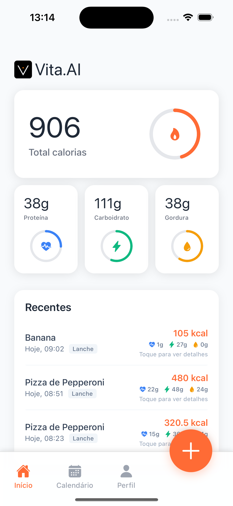
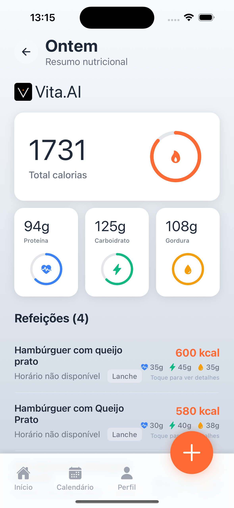
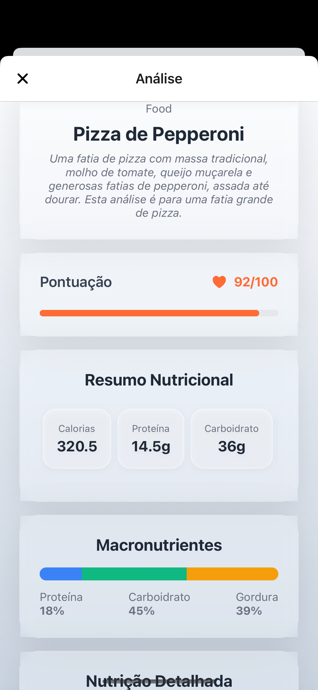

<div align="center">
  
  <h1>VITA AI: Intelligent Nutrition & Health Tracking</h1>
</div>

## About VITA AI

VITA AI is an intelligent nutrition and health tracking application that leverages the power of Google's Gemini AI to provide comprehensive food analysis and nutritional insights. Built with React Native and Expo, VITA AI offers a seamless mobile experience for users who want to understand their dietary habits and make informed health decisions.

### Key Features

- **AI-Powered Food Analysis**: Simply take a photo of your food and let Gemini AI analyze its nutritional content
- **Comprehensive Nutrition Tracking**: Track macronutrients (calories, protein, carbs, fats) and micronutrients (vitamins, minerals)
- **Smart Calendar Integration**: Visualize your nutritional intake over time with an intuitive calendar interface
- **Secure Authentication**: Built-in user authentication with Clerk for secure data management
- **Cross-Platform**: Works seamlessly on iOS, Android, and web platforms

### How It Works

1. **Capture**: Take a photo of your meal using the built-in camera or select from your gallery
2. **Analyze**: Our AI processes the image and identifies food items and portions
3. **Track**: Nutritional data is automatically logged and stored in your personal dashboard

## Screenshots

<div align="center">
  <h3>Main Dashboard</h3>
  
  
  <h3>Daily Summary</h3>
  
  
  <h3>Food Analysis</h3>
  
</div>

## Getting Started

### Prerequisites
- Node.js (LTS version)
- npm or yarn
- Expo CLI
- Google Gemini API key
- Clerk account for authentication
- Supabase account for database
- iOS Simulator or Android Emulator (for mobile development)

### Installation
1. Clone the repository:
   ```bash
   git clone https://github.com/yourusername/vita-ai.git
   cd vita-ai
   ```

2. Install dependencies:
   ```bash
   npm install
   # or
   yarn install
   ```

3. Set up environment variables:

   ```bash
   cp .env.example .env
   ```
   Add your API keys to the .env file:
   ```
   EXPO_PUBLIC_GEMINI_API_KEY=your_gemini_api_key_here
   EXPO_PUBLIC_CLERK_PUBLISHABLE_KEY=your_clerk_publishable_key_here
   EXPO_PUBLIC_SUPABASE_URL=your_supabase_url_here
   EXPO_PUBLIC_SUPABASE_ANON_KEY=your_supabase_anon_key_here
   ```

### Getting API Keys

#### Google Gemini API Key
1. Go to [Google AI Studio](https://aistudio.google.com/)
2. Sign in with your Google account
3. Click "Get API Key" in the left sidebar
4. Create a new API key or use an existing one
5. Copy the API key and add it to your `.env` file as `EXPO_PUBLIC_GEMINI_API_KEY`

#### Clerk Authentication Keys
1. Go to [Clerk Dashboard](https://dashboard.clerk.com/)
2. Sign up or sign in to your account
3. Create a new application or select an existing one
4. Go to "API Keys" in the left sidebar
5. Copy the "Publishable key" and add it to your `.env` file as `EXPO_PUBLIC_CLERK_PUBLISHABLE_KEY`
6. Optionally, copy the "Secret key" for server-side operations (not needed for this client-side app)

#### Supabase Database Keys
1. Go to [Supabase Dashboard](https://supabase.com/dashboard)
2. Sign up or sign in to your account
3. Create a new project or select an existing one
4. Go to "Settings" → "API" in the left sidebar
5. Copy the "Project URL" and add it to your `.env` file as `EXPO_PUBLIC_SUPABASE_URL`
6. Copy the "anon public" key and add it to your `.env` file as `EXPO_PUBLIC_SUPABASE_ANON_KEY`

### Database Setup

After obtaining your Supabase credentials, you need to set up the database schema:

1. In your Supabase project dashboard, go to "SQL Editor" in the left sidebar
2. Click "New query" to create a new SQL query
3. Copy the entire contents of the `schema.sql` file from this repository
4. Paste the SQL code into the query editor
5. Click "Run" to execute the schema and create all necessary tables

The schema will create the following tables:
- `profiles` - User profile information linked to Clerk authentication
- `food_entries` - Main table for logged food items
- `macronutrients` - Nutritional macro data (calories, protein, carbs, fats)
- `micronutrients` - Vitamin and mineral data

**Important**: Make sure to run the complete `schema.sql` file to ensure all tables, relationships, and constraints are properly created.

4. Start the development server:
   ```bash
   npm start
   # or
   yarn start
   ```

## Project Structure
```
vita-ai/
├── app/                  # Main application code
│   ├── api/             # API integration with Gemini AI
│   │   └── analyze+api.ts # Food analysis endpoint
|   ├── components/
│   ├── LoadingSkeleton.tsx # New animated skeleton
│   └── PulseAnimation.tsx  # Reusable pulse effect
│   ├── _layout.tsx      # Layout configuration
│   ├── index.tsx        # Main camera/gallery interface
│   └── result.tsx       # Analysis results display
├── assets/                 # Static assets and images
├── atoms/                  # Jotai atoms for state management
│   └── analysis.ts         # Analysis state management
├── lib/                    # Utility libraries
│   ├── queries/            # Database queries
│   │   ├── foodQueries.ts  # Food-related queries
│   │   ├── nutritionQueries.ts
│   │   └── userQueries.ts  # User-related queries
│   └── supabase.ts         # Supabase client configuration
├── schema.sql              # Database schema
└── expo-env.d.ts           # TypeScript declarations
```

## Development

### Available Scripts
- `npm start` - Start the Expo development server
- `npm run android` - Run on Android
- `npm run ios` - Run on iOS
- `npm run web` - Run on web browser
- `npm test` - Run tests
- `npm run lint` - Run linting
- `npm run reset-project` - Reset project configuration
